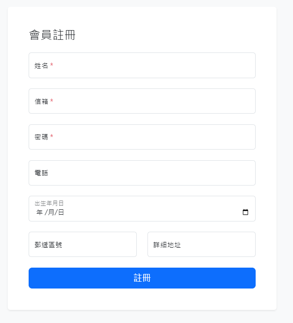

# Day 4 - 使用指令建立元件 題目



請 clone 這一份模板， 完成以下條件 :
- 將 components/ProductCard.vue  卡片的圖片、標題、價格、按鈕拆分成單獨的元件 ( 如圖 ) ，並且在 product/card 資料夾下進行管理。
- ProductCard.vue 的 CSS 需要跟元件一起拆分。props 的資料需要傳入元件。
- 在 pages/index.vue 的模板可以正常顯示卡片元件。

---

# Nuxt Minimal Starter

Look at the [Nuxt documentation](https://nuxt.com/docs/getting-started/introduction) to learn more.

## Setup

Make sure to install dependencies:

```bash
# npm
npm install

# pnpm
pnpm install

# yarn
yarn install

# bun
bun install
```

## Development Server

Start the development server on `http://localhost:3000`:

```bash
# npm
npm run dev

# pnpm
pnpm dev

# yarn
yarn dev

# bun
bun run dev
```

## Production

Build the application for production:

```bash
# npm
npm run build

# pnpm
pnpm build

# yarn
yarn build

# bun
bun run build
```

Locally preview production build:

```bash
# npm
npm run preview

# pnpm
pnpm preview

# yarn
yarn preview

# bun
bun run preview
```

Check out the [deployment documentation](https://nuxt.com/docs/getting-started/deployment) for more information.
